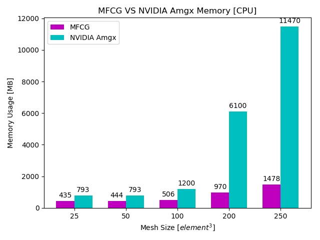
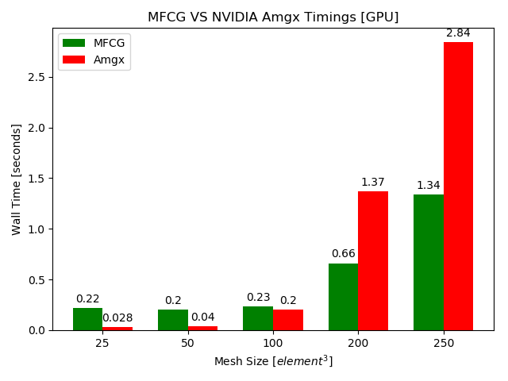

# GPU-enabled Matrix-Free Conjugate Gradient Method

## Abstract
- This paper presents an efficient GPU-based part-scale thermal process simulator for laser powder bed fusion (L-PBF) additive manufacturing (AM). To take full advantage of modern GPU computing, a matrix-free preconditioned conjugate gradient (PCG) finite element algorithm with voxel mesh is proposed to solve the transient heat transfer problem involved in the L-PBF process. The accuracy of the developed simulator is demonstrated by comparing with a commercial software (ANSYS) using representative L-PBF process parameters and temperature-dependent thermal properties for Ti6Al4V. For efficiency, it is found that the process simulation has a significant speedup going from a single CPU to a single GPU implementation. A speedup is also observed with the matrix-free method compared to a linear solver using a sparse matrix, both on a single GPU. In addition, several schemes devised to gain higher efficiency are discussed in details, which include exclusion of inactive elements from the memory, adaptive meshing in the build direction, preconditioner, and layer lumping. Using these schemes, the adaptability and scalability of the developed simulator are demonstrated on a complex geometry. A calibration of the model is also performed in realistic conditions with a thermocouple measurement coming from experimental data.Keywords: Additive manufacturing; Laser powder bed fusion; Matrix-free method; Finite element analysis; GPU computing; Heat transfer modeling; Process simulation

## Performance
- It achieves maximum speed up of ~112 x times and scales up to 550 x 550 x 550 hexahedral elements using double precision arithmetic
- A summary presentation is given at `petros_matrix-free.pptx.pdf`.

## Boosting performance using CUBLAS linear algebra kernels (ddot,daxpy,dnrm2).

## Runs on >= CUDA 10 versions on TITAN V, Quadro RTX, GTX Devices:
- Arch >= sm_70

## Usage
- Compile `make` to generate executable file (see makefile for compilation info).
- Execute `./GPU_CG`. 

## Demonstration
The results on memory and runtime performance are demonstrated below.

| Losses | Accuracies |
| --- | --- |
|  |  |

## Cite
- Florian Dugast, Petros Apostolou, Alfonso Fernandez, Wen Dong, Qian Chen, Seth Strayer, Ryan Wicker, Albert C. To,
Part-scale thermal process modeling for laser powder bed fusion with matrix-free method and GPU computing,
Additive Manufacturing, Volume 37, 2021, 101732, ISSN 2214-8604, https://doi.org/10.1016/j.addma.2020.101732.
(https://www.sciencedirect.com/science/article/pii/S2214860420311040)

## Contact
- apost035@umn.edu, trs.apostolou@gmail.com
